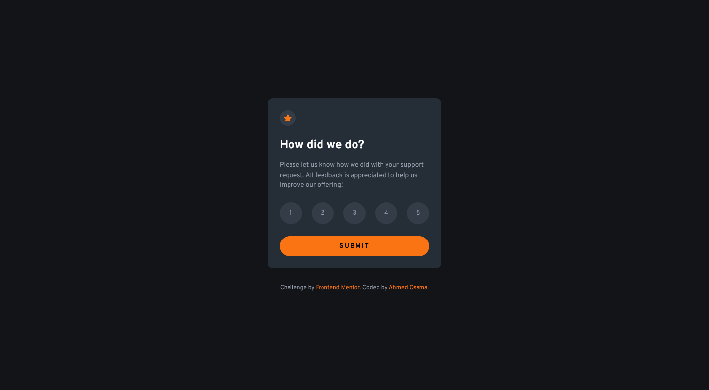
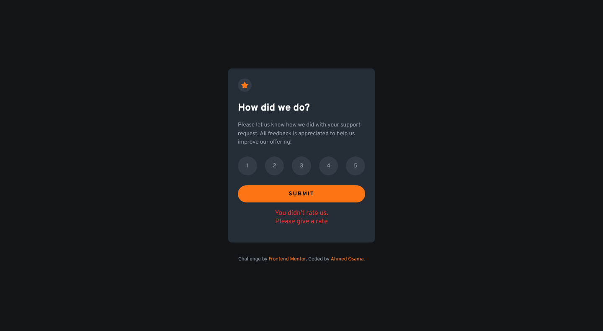
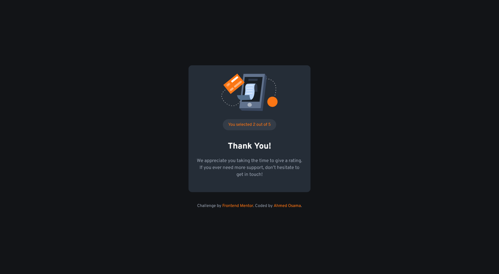

# Frontend Mentor - Interactive rating component solution

This is a solution to the [Interactive rating component challenge on Frontend Mentor](https://www.frontendmentor.io/challenges/interactive-rating-component-koxpeBUmI). Frontend Mentor challenges help you improve your coding skills by building realistic projects.

## Table of contents

- [Overview](#overview)
  - [The challenge](#the-challenge)
  - [Screenshots](#screenshots)
  - [Links](#links)
- [My process](#my-process)
  - [Built with](#built-with)
- [Author](#author)

## Overview

### The challenge

Users should be able to:

- View the optimal layout for the app depending on their device's screen size
- See hover states for all interactive elements on the page
- Select and submit a number rating
- See the "Thank you" card state after submitting a rating

### Screenshots

### Links

- Solution URL: [Solution URL](https://www.frontendmentor.io/solutions/mobile-first-interactive-rate-us-page-y2vNNZFuFS)
- Live Site URL: [Live site URL](https://ahmed-osama99.github.io/Interactive-rate-page-challenge/)

## My process

### Built with

- Semantic HTML5 markup
- CSS custom properties
- Flexbox
- Mobile-first workflow
- Vanilla JavaScript

## Author

- Frontend Mentor - [@Ahmed-Osama99](https://www.frontendmentor.io/profile/Ahmed-Osama99)
- Codepen - [@ahmed-osama99](https://codepen.io/ahmed-osama99)
